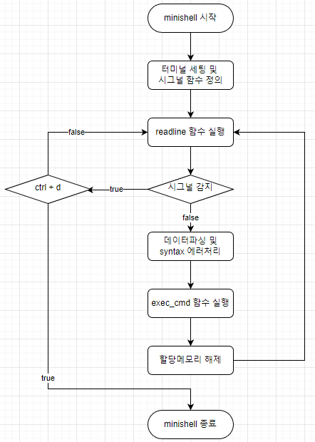
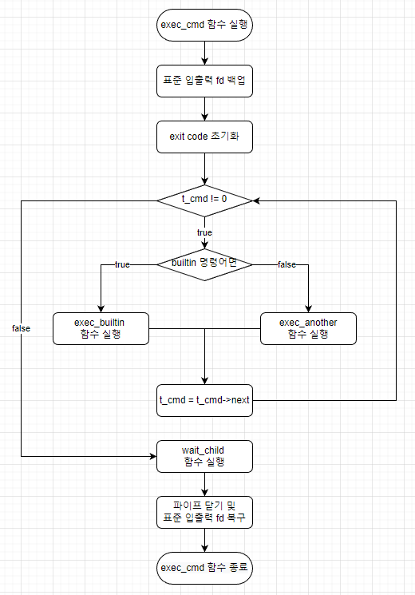
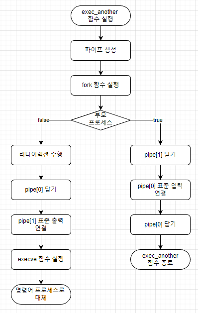
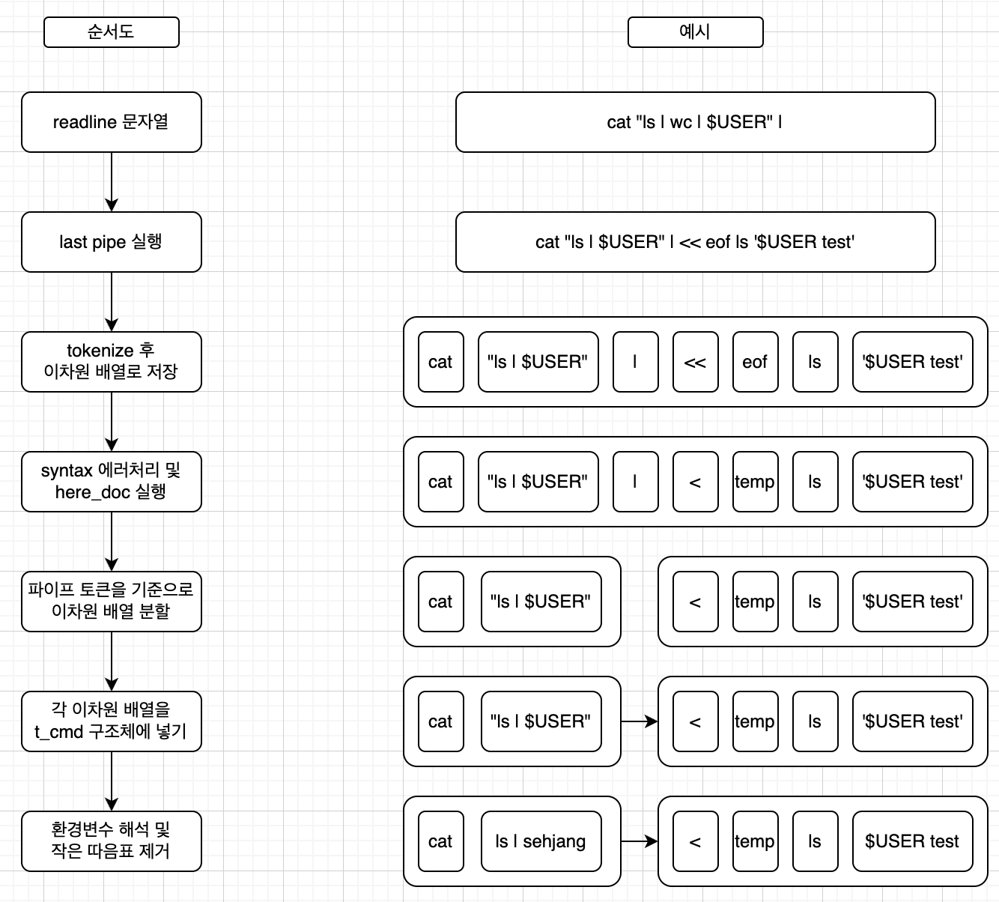

# **minishell**
  
## **1. minishell 소개**
**minishell**
> bash 처럼 shell 명령어를 사용할 수 있는 간단한 미니쉘  

**minishell 기능**
1. builtin 명령어 echo, pwd, env, unset, export, exit, cd 명령어 사용 가능
2. 멀티 파이프 라인 기능 지원
3. 리다이렉션 기능 지원 ( in/out/here_doc )
4. 시그널 지원 ( ctrl + D / C / \ )

**[minishell 과제 내용]()**

## **2. minishell 구조**
### **minishell FlowChart**

> 미니쉘 프로그램을 실행하면 기본적으로 루프를 돌면서 사용자에게 명령을 입력 받고, 입력 받은 문자열을 파싱하여 원하는 객체에 데이터를 생성하고 명령어 실행 함수를 실행하게 된다.

### **exec_cmd 함수 FlowChart**

> 명령어 실행 함수는 크게 builtin 명령어와 non-builtin 명령어로 나뉘는데, builtin 명령어라면, 프로세스를 fork 하지 않고, built 내장 함수를 실행하고, non-builtin 명령어 라면, 프로세스를 fork하여 execute 함수를 실행한다.

### **exec_another 함수 FlowChart**

> non-builtin 명령어는 프로세스를 fork 하여 자식 프로세스에서 execute 함수를 실행하게 된다. execute 함수를 실행하는 순간, 해당 자식 프로세스는 명령어 프로세스로 대체된다.

### **데이터 파싱 FlowChart**

> 데이터 파싱에서 먼저 끝에 파이프가 오는지 검사하고, 문자열을 각각의 토큰으로 분리하여 저장한 후, syntax error, here_doc 처리를 거친 후에 파이프 기준으로 명령어를 자른 뒤 객체에 데이터가 담기게 된다.